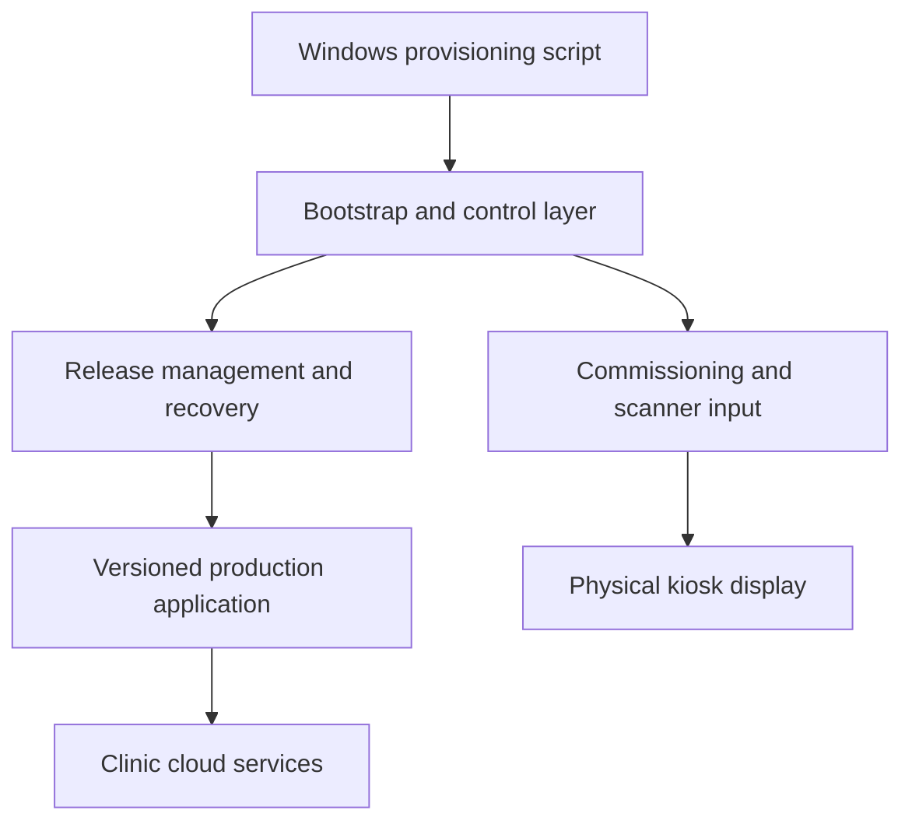

# Multimedica Scanner Installation and Commissioning

## Theory of Operation

**Audience:** Developers, maintainers, and technical deployment owners  
**Scope:** Raspberry Pi scanner bootstrap installation, commissioning, production release installation, verification, rollback, and startup recovery  
**Status:** Describes the validated deployment architecture as of August 2026

---

## 1. Purpose

This document explains how the Multimedica scanner installation and commissioning system works and why it contains more structure than a conventional file-copy script.

It is not an operator installation manual. The operator manual should contain the approved commands, expected observations, and stop conditions. This document instead provides the architectural reasoning needed to maintain that workflow safely.

The system is designed to answer four separate questions:

1. Is the Raspberry Pi bootstrap platform correctly installed?
2. Has the scanner received complete and authorized configuration?
3. Has a specific production release been validated and installed?
4. Is that production release presently authorized and healthy?

These questions must not be collapsed into a single “installation completed” flag.

---

## 2. Core design principle: deployment as a contract

A simple deployment script defines success as a sequence of commands completing without an error:

```text
Copy files
Install dependencies
Start services
```

The Multimedica provisioning process defines success as a repeatable contract. A successful operation must establish and verify explicit postconditions, such as:

- the hardware and operating system meet the qualified baseline;
- transferred files and release artifacts have the expected contents;
- secrets were not exposed in command lines, logs, or result files;
- required services are installed and active;
- health endpoints return the expected service identity and state;
- the USB scanner and scanner reader are operational;
- configuration is complete;
- a production candidate passed validation before promotion;
- the physical display showed the expected candidate state;
- promoted production passed its own health checks;
- persistent installed-version state agrees with the active release;
- failures leave the Pi in a defined recoverable or safely disabled state.

This contract is repeatable because `-Verify` can inspect the current Pi later rather than trusting what a previous installer remembers doing.

---

## 3. Architectural layers

The scanner has two primary software layers.



### 3.1 Windows provisioning tool

`provision-scanner.ps1` is the operator-facing deployment tool. It establishes SSH access, transfers approved files, invokes privileged operations, verifies the Pi, installs production releases, and writes structured results.

It is not part of everyday scanner operation. The Pi runs independently after provisioning.

Principal modes include:

| Mode | Responsibility |
|---|---|
| `-ConfigureSshAccess` | Establish the dedicated workstation-to-Pi provisioning key |
| `-Install` | Install the bootstrap platform on a clean image |
| `-Verify` | Inspect current state without changing it |
| `-Repair` | Reinstall bootstrap resources when the current release state permits it |
| `-UpdateDisplay` | Atomically update the approved display asset allowlist |
| `-InstallRelease` | Validate, promote, and record a production release |

### 3.2 Bootstrap layer

The bootstrap layer is installed primarily under:

```text
/opt/multimedica-scanner/bootstrap
```

It contains the stable control capabilities needed before and around production:

- scanner input reader;
- QR configuration validation and application;
- controller API;
- display server and kiosk startup;
- restricted Wi-Fi and reboot helpers;
- release installer and manager;
- startup recovery logic;
- schemas and supporting modules.

The bootstrap layer is analogous to appliance firmware: production versions may change, but bootstrap remains available to configure, install, verify, and recover them.

### 3.3 Production layer

Production code performs ordinary clinic scan processing and cloud interaction. Releases are installed into immutable version directories:

```text
/opt/multimedica-scanner/releases/1.0.4
```

The active release is selected through:

```text
/opt/multimedica-scanner/current
```

For example:

```text
current -> releases/1.0.4
```

The production systemd service always starts through `current`. Promotion changes the symbolic link; it does not overwrite a running production directory in place.

### 3.4 Persistent state

Persistent configuration and release state live separately from application code:

```text
/var/lib/multimedica-scanner/state
```

This includes configuration, secrets, installed-version records, transaction records, and known-good release information. Replacing application code must not erase scanner identity or release history.

### 3.5 Transient runtime state

Short-lived runtime controls live under:

```text
/run/multimedica-scanner
```

`/run` is cleared at reboot. Anything stored there must either be deliberately temporary or reconstructed during startup recovery.

---

## 4. Gates and markers

Both gates and markers may be represented by files, but their semantics differ.

### 4.1 Gate

A gate controls whether an operation is permitted.

The production gate is:

```text
/run/multimedica-scanner/production-allowed
```

| Gate state | Meaning |
|---|---|
| Present | Production is authorized to start |
| Absent | Production must remain stopped |

The production service has a systemd condition tied to this path. Removing the gate prevents systemd restart behavior from repeatedly starting an unvalidated release.

Because `/run` is cleared at reboot, startup recovery must re-establish the authorization decision from persistent evidence.

### 4.2 Marker

A marker communicates that a temporary condition exists.

The bootstrap installation marker is:

```text
/run/multimedica-scanner/bootstrap-installing
```

Its presence tells the controller and display that installation acceptance is incomplete. The user should see a waiting message rather than instructions claiming the scanner is ready.

In short:

- **Gate:** this operation is or is not allowed.
- **Marker:** this temporary condition is currently true.

---

## 5. Services and ports

Principal systemd services:

| Service | Responsibility |
|---|---|
| `multimedica-display.service` | Serves the browser display application |
| `multimedica-kiosk.service` | Starts X and the physical Chromium kiosk |
| `multimedica-controller.service` | Owns scanner input and commissioning |
| `multimedica-production.service` | Runs the active production release |
| `multimedica-release-recovery.service` | Reconciles and authorizes production after boot |

Normal loopback ports:

| Port | Service |
|---:|---|
| 3000 | Controller |
| 3001 | Display server |
| 3002 | Active production service |
| 3003 | Temporary candidate release |

Candidate and production use separate ports so the candidate can be validated without first replacing the active release.

---

## 6. Clean-image installation

### 6.1 Configure SSH access

`-ConfigureSshAccess` establishes a dedicated provisioning SSH key.

If the Pi was reimaged, its SSH host identity changed. The script asks the operator explicitly and, when authorized, removes the stale workstation `known_hosts` entry before recording the new identity.

The provisioning private key remains on the Windows workstation. Only its public key is installed in the Pi user’s `authorized_keys` file.

SSH authentication and root authorization are separate:

- the SSH key permits login as `multimedica_edge`;
- `sudo` controls specific privileged operations.

Key-based login does not imply unrestricted root access.

### 6.2 Platform preflight

Before installation, the script checks capabilities including:

- Raspberry Pi hardware;
- 64-bit ARM architecture;
- qualified Debian release;
- sufficient storage;
- reachable SSH service.

This prevents installation onto an unsupported device that merely answers at the expected hostname.

### 6.3 Staging before activation

Bootstrap source, schemas, package metadata, and the token transfer file are copied into a temporary remote staging area before privileged installation begins.

If the network fails during copying, the authoritative installation remains untouched. Successful transfer is therefore distinct from successful activation.

### 6.4 Privileged installation

Root privileges are required to create installation and state roots, install systemd units, install restricted helpers, set ownership and permissions, enable services, and install dependencies.

The PowerShell script opens an attached TTY for the sudo step. The Pi password is read directly by sudo; PowerShell does not redirect or capture it.

### 6.5 Restricted privileged helpers

The controller is not given general root access. Bootstrap installs narrowly scoped helpers and sudo rules for operations such as:

- applying Wi-Fi configuration;
- rebooting;
- executing the validated release installer.

The sudo policy authorizes the exact helper rather than arbitrary commands. This is a least-privilege boundary between the Node application and the operating system.

### 6.6 Bootstrap acceptance and reboot

Installation validates the display, controller, kiosk, health endpoint, USB scanner, and scanner reader. It then reboots the Pi to prove that systemd can reconstruct the bootstrap platform without the installer manually starting processes.

---

## 7. Commissioning by QR

The scanner receives three categories of configuration:

| QR | Supplies |
|---|---|
| Wi-Fi | SSID, security, and password |
| Station | Location, room, station, and device identity |
| Cloud | Endpoint and shared secret |

QR commissioning uses the scanner’s intended input hardware and avoids creating a general-purpose local administrative interface.

### 7.1 Authorization

Configuration QRs are authorized using the QR administrator token installed during bootstrap. The token distinguishes an authorized configuration envelope from an ordinary patient barcode or arbitrary configuration attempt.

### 7.2 Configuration and secrets

Non-secret values are stored in the configuration store, including location, room, station, device ID, endpoint URL, and Wi-Fi SSID.

Secrets are stored separately with restricted access, including Wi-Fi password, cloud shared secret, and QR administrator token.

Secrets must never be printed, displayed, passed as ordinary command-line arguments, or included in result files.

### 7.3 Wi-Fi application

The Wi-Fi helper runs with restricted root privilege. It creates or updates a NetworkManager profile, attempts activation, verifies the expected active connection, and restores the prior connection if activation fails.

The controller saves the new Wi-Fi configuration only after activation succeeds. A failed QR must not replace working credentials or make commissioning appear complete.

Wi-Fi may already be available from image-time configuration. The QR path remains supported for sites that do not configure Wi-Fi during imaging and for later credential replacement.

### 7.4 Identity QR

The `show_identity` QR is intended to request a local, non-secret identity display. A future enhancement should include explicit production and bootstrap versions. At the time of this document, a physical no-response defect has been observed and remains to be diagnosed.

---

## 8. Verification

`-Verify` is a read-only observation operation. It checks the Pi’s current state rather than assuming a previous installer run remained valid.

It examines bootstrap services, display health, kiosk process, scanner device and reader, configuration completeness, release infrastructure, and production state.

`provisioning-result.json` records structured observations such as:

```text
platform_verified
services_healthy
scanner_device_detected
configuration_complete
release_installed
production_healthy
```

The result file is a report from one run, not the Pi’s authoritative state, and should normally not be committed to Git.

The controller health API publishes:

- `scanner_device_detected`;
- `scanner_reader_active`;
- `scanner_input_ready`, defined as both preceding conditions being true.

The ambiguous legacy field `scanner_connected` is not part of the public response.

---

## 9. Production versioning

The formal release version, such as `1.0.4`, identifies the production application that performs everyday clinic work. It does not currently identify the complete bootstrap/deployment platform.

The version is explicitly supplied during the production build; it is not automatically incremented.

Recommended semantic versioning:

| Change | Example | Use |
|---|---|---|
| Patch | `1.0.4` to `1.0.5` | Backward-compatible correction |
| Minor | `1.0.4` to `1.1.0` | Backward-compatible feature |
| Major | `1.0.4` to `2.0.0` | Incompatible contract or migration |

The critical rule is that different artifact contents must never be published under the same version. If production artifact bytes change, assign a new production version.

Bootstrap resources are currently identified primarily through Git history. A future explicit bootstrap version record would improve support and fleet consistency.

---

## 10. Production artifact and checksum

The production build generates:

```text
multimedica-production-<version>.tgz
multimedica-production-<version>.tgz.sha256
multimedica-production-<version>.build.json
```

The archive contains the deployable release. The SHA-256 value detects corruption, incomplete transfer, and selection of the wrong artifact. The build record improves traceability.

A checksum proves byte equality with the expected artifact. It does not by itself prove correct behavior, which is why candidate and production validation remain necessary.

---

## 11. Release transaction

Each release installation creates a persistent transaction with a unique ID under the release state directory.

The transaction records completed stages such as resolution, download, checksum verification, extraction, dependency installation, candidate startup, promotion, production activation, and rollback.

Persistent stages make failures diagnosable and allow startup recovery to reason about interrupted work. Recovery does not blindly resume at the next source-code line; it reconstructs actual state from transaction records, links, directories, gates, and health observations.

---

## 12. Candidate validation

An extracted release first runs as a candidate on port 3003.

Validation confirms:

- the process started;
- the expected health endpoint responds;
- response identity and state are correct;
- manifest and entry point agree;
- the process is executing from the expected candidate directory.

Automated health cannot prove that the attached physical display rendered the candidate state. The operator must observe `CANDIDATO` and explicitly type `yes` before promotion.

This is a physical acceptance check, not a security credential.

---

## 13. Promotion

After candidate health and operator confirmation:

1. stop the candidate;
2. rename staging to the immutable version directory;
3. create a temporary sibling symbolic link;
4. atomically replace `current` with that link;
5. create the production gate;
6. start production on port 3002;
7. verify production health and execution path;
8. record installed and known-good version state.

The symbolic-link replacement is atomic: observers see either the old target or the new target, not a partially written link. The entire promotion workflow is not one filesystem-atomic operation; persistent transactions and recovery are still required.

A candidate is not marked known-good merely because it passed on port 3003. It must also prove that it works through the production systemd unit, production environment, `current` link, production gate, permissions, and port 3002.

---

## 14. Rollback and first activation failure

When a new production release fails and a validated previous release exists, automatic rollback can stop failed production, restore `current`, recreate the gate, restart the previous release, verify health, and record the failed promotion.

On first production installation, no previous release exists. If first activation fails, production is stopped, the gate is removed, and the transaction records a first-activation failure. The Pi remains in bootstrap mode instead of claiming production readiness.

If restoration itself fails, the transaction records rollback failure and manual intervention is required.

---

## 15. Reboot recovery

Because `/run` is cleared at reboot, production authorization must be reconstructed.

The recovery service reads persistent release state, validates the `current` link and release directories, examines incomplete transactions, restores the gate only when safe, starts production, and verifies it.

Examples:

| Observed state | Recovery response |
|---|---|
| Failure before `current` changed | Mark attempted transaction failed |
| Version renamed but link not switched | Safely complete or reject promotion |
| Link switched and production healthy | Finalize installed-version state |
| New production unhealthy and previous valid | Roll back |
| First release unhealthy | Disable production |
| Path points outside approved roots | Refuse unsafe recovery |

The system prioritizes a defined safe state over attempting to execute an unjustified target.

---

## 16. Repair and supported maintenance paths

### 16.1 `-Repair`

Broad bootstrap repair is appropriate only when release state permits it. It is intentionally blocked on production-managed appliances where replacing bootstrap and systemd resources could invalidate the release manager’s assumptions.

This refusal protects the agreement among the production gate, `current` link, installed-version state, services, and recovery logic.

### 16.2 `-UpdateDisplay`

Display maintenance uses a narrow approved allowlist rather than broad repair:

```text
app.js
full_logo.png
index.html
styles.css
start-kiosk.sh
```

The updater stages and validates the bundle, backs up installed assets, swaps them, restarts display services, checks health, and rolls back on failure.

The privileged installation step runs through an attached TTY so sudo reads the Pi password directly. Noninteractive staging and transfer commands detach stdin and use bounded connection and keepalive settings.

### 16.3 Future bootstrap upgrade path

The system has a formal versioned production upgrade mechanism but only narrowly supported bootstrap update paths. A general versioned bootstrap-upgrade mechanism remains a future architectural improvement.

---

## 17. SSH and privilege safety

Noninteractive SSH operations use the dedicated provisioning key, batch mode, detached stdin, connection timeout, and server keepalives. This prevents hidden password fallback and avoids waiting indefinitely on inherited console input.

Interactive operations are deliberately limited to steps that require operator participation:

- clean-image sudo installation;
- privileged display update;
- attached production candidate confirmation.

The Pi password must remain hidden and must not be captured in PowerShell output or `provisioning-result.json`.

An observed UX edge case remains: an accidental extra Enter may be consumed before the remote sudo prompt becomes visible. A future improvement should make the waiting state unmistakable and visibly retry empty input.

---

## 18. Jest and development verification

Jest is a development and release-readiness tool. It is not part of normal Pi installation or commissioning.

Tests include:

- unit tests for parsing and state decisions;
- integration-style tests using temporary files and local servers;
- contract tests protecting scripts, schemas, units, and security rules;
- failure-path tests for unhealthy candidates, Wi-Fi failures, promotion interruption, and rollback.

Mocks substitute controlled behavior for physical displays, Wi-Fi, systemd, cloud services, and scanners. Temporary directory trees simulate installation and state roots.

`--runInBand` executes tests sequentially to reduce conflicts involving ports, environment variables, filesystem fixtures, timers, and release locks.

`--detectOpenHandles` identifies servers, sockets, timers, or child processes that would otherwise keep Node running after assertions complete.

Jest cannot prove physical orientation, LCD rendering, USB events, NetworkManager behavior on the installed Pi, or the operator’s observation of `CANDIDATO`. Development tests, real-Pi validation, and physical acceptance are complementary layers.

Future operator installation documentation should not require ordinary installers to run Jest. It belongs in developer and release-preparation documentation.

---

## 19. Intended operational workflows

### 19.1 Clean scanner

1. Boot the approved clean Pi image.
2. Run `-ConfigureSshAccess`.
3. Run `-Install` and enter the Pi sudo password when requested.
4. Wait for successful reboot and stable commissioning display.
5. Scan required configuration QRs.
6. Run `-Verify`.
7. Select or build an approved production artifact.
8. Run `-InstallRelease`.
9. Observe `CANDIDATO` and explicitly authorize promotion.
10. Verify production health, physical clinic display, real scan behavior, and reboot recovery.

### 19.2 Troubleshooting

Begin with read-only `-Verify`. Collect current evidence before choosing repair, display update, release installation, or manual investigation.

### 19.3 Production update

Assign a new production version, build and hash the artifact, then use `-InstallRelease`. Do not edit a promoted version directory in place and do not reuse a version number for different bytes.

### 19.4 Display update

Use `-UpdateDisplay`; do not manually copy individual display assets onto the Pi.

---

## 20. Acceptance evidence

The system combines three forms of evidence:

### Intended state

Configuration, transaction, and installed-version records describe what should be running.

### Observed software state

Services, processes, links, gates, ports, and health endpoints describe what is running.

### Observed physical state

The display and a real scanned barcode demonstrate the appliance’s externally visible behavior.

A scanner should be accepted only when these forms of evidence agree.

---

## 21. Known future improvements

The following items are not current deployment blockers but remain useful backlog work:

1. Diagnose the Identity QR no-response defect.
2. Extend the Identity QR display with production and bootstrap versions.
3. Establish an explicit bootstrap version record and report it through verification.
4. Implement a safe retention policy for old unreferenced production release directories.
5. Improve visibility and empty-input handling at attached sudo prompts.
6. Create a formal versioned bootstrap-upgrade mechanism for production-managed appliances.
7. Consider enforcing artifact-version immutability so the same version cannot be rebuilt with different bytes.

---

## 22. Summary

The deployment system is intentionally divided into bootstrap installation, authorized commissioning, production release management, physical acceptance, and startup recovery.

Its complexity exists to preserve evidence and safe choices across partial transfers, invalid credentials, unhealthy candidates, permission failures, interrupted promotion, reboot, and rollback. The central operating principle is:

> The bootstrap layer establishes and continually verifies the conditions under which a specific production release is allowed to run.

That principle should guide future changes to the installer, release manager, documentation, and support procedures.
