# Multimedica Scanner Appliance Installation Guide

**Audience:** Technical installer
**Applies to:** New or freshly reimaged Raspberry Pi scanner appliances
**Qualified baseline:** Raspberry Pi 4 Model B, Raspberry Pi OS Lite 64-bit, Debian 13 Trixie
**Last validated:** August 2026

---

## 1. Purpose

This guide describes the supported procedure for turning a clean Raspberry Pi into a commissioned Multimedica scanner with a validated production release.

Use the Windows provisioning script for installation and verification. Do not clone the repository onto the Pi, copy individual runtime files manually, or edit files under `/opt/multimedica-scanner` as part of ordinary installation.

---

## 2. Where the scanner appliance fits

The scanner appliance is one component of the complete **Alfarero Clinic (Multimédica)** system. It is not a stand-alone application. The appliance reads configuration QR codes during commissioning and patient workflow barcodes during everyday clinic operation, while the main Multimédica application supplies the configuration and patient workflow information.

Authorized users generate the required scanner configuration QR codes in the main Multimédica application at [https://multimedica.org](https://multimedica.org). Those codes configure the appliance's Wi-Fi, station identity, and cloud connection. The installer should obtain the approved QR codes from an authorized Multimédica user; the installer should not compose or modify their contents manually.

Patient workflow tickets are printed from the **Anfitrión** page of the Multimédica application. The clinic must use one of these supported printing arrangements:

1. **Page printer:** Print from Windows to a compatible conventional printer.
2. **Thermal ticket printer:** Install and configure the separate `local-print-server` application on a Windows computer that can communicate with the thermal printer and is reachable over the clinic network from the users' devices.

The thermal printing path is a separate installation responsibility and is not installed by this scanner-appliance procedure. Before commissioning a clinic that uses thermal tickets, confirm that the Windows print-server computer, `local-print-server`, thermal printer, and relevant network access are available and working.

### 2.1 What this procedure installs on the appliance

The completed appliance contains two software layers:

1. **Bootstrap layer:** scanner input, QR commissioning, display, kiosk, release management, and recovery.
2. **Production release:** versioned everyday scan processing and clinic-cloud communication.

These layers are installed and accepted separately. A completed bootstrap installation does not by itself mean production is installed.

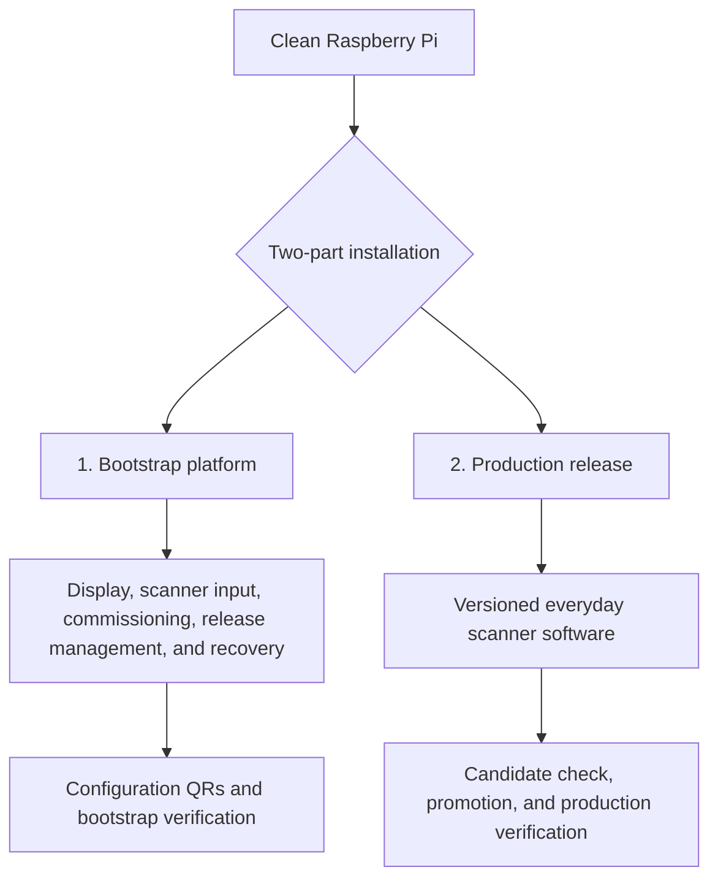

The bootstrap path establishes and commissions the appliance platform. The production path installs a specific approved release only after the bootstrap platform has passed verification.

For a developer-oriented explanation of how these layers work together—including commissioning, release promotion, rollback, recovery, gates, and markers—see [Scanner Installation Theory of Operation](SCANNER-INSTALLATION-THEORY-OF-OPERATION.md). Reading it is optional for an installer following this procedure, but recommended for anyone maintaining or troubleshooting the system.

---

## 3. Command conventions

This guide uses these terms consistently:

- **Pi:** the Raspberry Pi 4 computer inside the appliance.
- **Scanner:** the USB barcode scanner connected to the Pi.
- **Scanner appliance:** the complete assembly: Pi, display, USB scanner, enclosure, storage, and installed software.
- **Provisioning workstation:** the Windows computer from which the installer runs the installation commands.

| Label | Meaning |
|---|---|
| **Windows** | Run in Windows PowerShell from the repository root |
| **Scanner** | Scan a printed QR with the appliance barcode scanner |
| **Physical** | Observe or manipulate the Pi, display, cables, or power |

PowerShell continuation commands use the backtick character at the end of each continued line. Do not add characters after the backtick.

The repository root is the directory containing:

```text
provision-scanner.ps1
package.json
bootstrap/
production/
tests/
```

### Installation worksheet

Use this worksheet to record the non-secret values that will be reused throughout this procedure. Print it or copy it onto paper, and keep it available while imaging and provisioning the Pi. Record the Pi password only in the approved password manager or other secure credential record—not in this worksheet.

```text
MULTIMÉDICA SCANNER INSTALLATION WORKSHEET

Pi hostname:
__________________________________________________________


Pi username:
__________________________________________________________


PiHost value (username@hostname):
__________________________________________________________


Pi password stored in approved secure location:  [ ] Yes
```

At the beginning of the provisioning session, enter the recorded values once:

```powershell
$piUser = Read-Host "Enter the Pi username recorded during imaging"
$piHostname = Read-Host "Enter the Pi hostname recorded during imaging"
$piHost = "$piUser@$piHostname"
$piHost
```

Confirm that the displayed `$piHost` combines the correct username and hostname. The remaining PowerShell examples use `$piHost` and `$piHostname`; set them again after opening a new PowerShell window.

---

## 4. Stop conditions

Stop the procedure and investigate if any of the following occurs:

- the provisioning script reports `RESULT: FAIL`;
- SSH reports an unexpected host-key change and the Pi was not deliberately reimaged;
- a password is displayed in clear text or appears in captured output;
- a required QR is rejected;
- the scanner USB device or reader is not detected;
- the physical display does not show `CANDIDATO` during release installation;
- production health does not pass;
- the final clinic display or real-patient scan is incorrect.

Do not continue merely because a later step might appear to work. Preserve `provisioning-result.json` and the console output for diagnosis.

---

## 5. Required hardware

- Raspberry Pi 4 Model B
- 32 GB or larger high-quality microSD card
- Qualified HDMI portrait display
- HDMI jumper or cable required by the display
- Display standoffs and mounting hardware
- Compatible USB barcode/QR scanner that presents scans as keyboard-style input
- Raspberry Pi USB-C power supply
- Right-angle USB-C cable when required by the enclosure
- Ethernet cable or Wi-Fi network access
- Completed scanner enclosure and suitable fasteners

Qualified reference hardware and image details are recorded in [Bootstrap Architecture](bootstrap-architecture.md).

---

## 6. Hardware assembly

Perform assembly with power disconnected.

### 6.1 Mount the display

1. Align the display with the Raspberry Pi GPIO header if the display uses that header mechanically or electrically.
2. Confirm every pin is aligned before applying pressure.
3. Install the HDMI jumper between the display and the Pi micro-HDMI port.
4. Confirm the jumper is fully seated and not under tension.
5. Install the required standoffs and screws.

The completed assembly must be rigid, with no bent GPIO pins or stressed HDMI connectors.

### 6.2 Connect the scanner

Connect the compatible USB barcode/QR scanner to a Raspberry Pi USB port. Do not assume the Linux event-device number; the bootstrap reader discovers the device dynamically.

### 6.3 Route cables

The appliance operates in portrait orientation. Route scanner, network, and other external cables through the intended enclosure exit. Use a right-angle USB-C power cable when necessary to avoid enclosure interference.

### 6.4 Hardware check

- [ ] Display firmly mounted
- [ ] HDMI connection fully seated
- [ ] Scanner connected by USB
- [ ] microSD card available for imaging
- [ ] Network connection available
- [ ] Power cable fits without stress
- [ ] No exposed conductor, pin, or board is shorted by the enclosure

---

## 7. Prepare the Windows provisioning workstation

Complete this section before imaging the Pi. The provisioning workstation requires internet access while downloading tools and the repository.

### 7.1 Install Git for Windows

Download Git for Windows from <https://git-scm.com/download/win> and run the installer. The standard installation options are suitable unless the organization maintains another approved configuration. Close and reopen PowerShell, then verify:

```powershell
git --version
```

The command must return a version. If PowerShell reports that `git` is not recognized, stop and correct the installation or PATH.

### 7.2 Install Node.js and npm

Download a supported Node.js LTS release from <https://nodejs.org/en/download>. Install Node.js with npm included. Close and reopen PowerShell, then verify:

```powershell
node --version
npm --version
```

Both commands must return version numbers.

### 7.3 Confirm Windows PowerShell

Open **Windows PowerShell** and run:

```powershell
$PSVersionTable.PSVersion
```

Windows PowerShell 5.1 or a later compatible PowerShell is required. Do not paste Bash commands containing syntax such as `<<EOF` into PowerShell.

### 7.4 Install Raspberry Pi Imager

Download Raspberry Pi Imager from <https://www.raspberrypi.com/software/> and install it. The screenshots in this guide use version 2.0.11.1; later versions may differ slightly while retaining the same required settings.

### 7.5 Obtain the installation repository

The supported installation repository is <https://github.com/paullmullen/multimedica-scanner>.

For a first checkout:

```powershell
New-Item -ItemType Directory -Force C:\dev | Out-Null
Set-Location C:\dev
git clone https://github.com/paullmullen/multimedica-scanner.git
Set-Location C:\dev\multimedica-scanner
```

For an existing checkout, first confirm that it contains no uncommitted work:

```powershell
Set-Location C:\dev\multimedica-scanner
git status --short
```

**Expected result:** no output at all before the next PowerShell prompt:

```text
PS C:\dev\multimedica-scanner> git status --short
PS C:\dev\multimedica-scanner>
```

If any filename or status code appears, the result is not clean. Examples include `M`, `D`, or `??` followed by a filename. Stop and seek qualified help; do not discard another developer's work.

Update the approved branch without creating a merge commit:

```powershell
git switch main
git pull --ff-only origin main
git status --short
git log -1 --oneline
```

Record the displayed commit in the installation record. `git status --short` should return nothing.

The second `git status --short` has the same expected result: no output before the prompt. Any filename means stop.

Install the repository's exact Node dependencies:

```powershell
npm ci
```

### 7.6 Workstation readiness check

- [ ] `git --version` succeeds
- [ ] `node --version` succeeds
- [ ] `npm --version` succeeds
- [ ] Raspberry Pi Imager opens
- [ ] Repository is at the approved `main` commit
- [ ] `git status --short` returns nothing
- [ ] `npm ci` completed successfully
- [ ] PowerShell prompt is at the repository root

---

## 8. Prepare configuration and release materials

Complete this section on the Windows provisioning workstation before installing the Pi.

### 8.1 Confirm the approved repository revision

Use an approved, tested repository revision. Do not perform development changes during a field installation.

From the repository root, confirm the working tree is clean:

```powershell
git status --short
```

Expected: no output. If any filename appears, stop and resolve it before installation.

For an approved installation package rather than a Git checkout, extract it into a local working directory while preserving its folder structure.

### 8.2 Unblock the provisioning script when required

Files downloaded through a browser or received in a ZIP may carry a Windows security mark.

```powershell
Unblock-File .\provision-scanner.ps1
```

### 8.3 Prepare the installer configuration

The protected installer configuration contains the QR administrator token used to authorize commissioning QRs.

If an approved `multimedica-installer.json` already exists:

```powershell
Test-Path .\multimedica-installer.json
```

Expected:

```text
True
```

If it must be created:

```powershell
.\provision-scanner.ps1 -CreateInstallerConfig
```

Follow the hidden token prompt. Keep this file secure and never commit it to Git.

### 8.4 Prepare the configuration QRs

Generate the authorized QRs from the Multimedica administrative interface:

- Wi-Fi configuration QR
- Station configuration QR
- Cloud configuration QR
- Identity QR

Printed Wi-Fi and Cloud QRs contain credentials. Control and destroy unneeded copies appropriately.

The Identity QR is used during final acceptance to show the configured location, room, station, device ID, current IP address, and installed production version.

### 8.5 Obtain the production artifact

The approved repository revision must already contain all four release files:

```text
release-output/approved-production-release.json
release-output/multimedica-production-<version>.tgz
release-output/multimedica-production-<version>.tgz.sha256
release-output/multimedica-production-<version>.build.json
```

The installer does not choose, type, or infer the approved version. Load it from the committed pointer and validate the complete release set:

```powershell
$approvedReleasePath = ".\release-output\approved-production-release.json"
if (-not (Test-Path $approvedReleasePath)) { throw "Approved-release pointer is missing from the repository." }

$approvedRelease = Get-Content $approvedReleasePath -Raw | ConvertFrom-Json
$releaseVersion = [string]$approvedRelease.version
$artifactFile = Join-Path ".\release-output" ([string]$approvedRelease.artifact)
$checksumFile = "$artifactFile.sha256"
$buildMetadataFile = Join-Path ".\release-output" ([string]$approvedRelease.build_metadata)

foreach ($requiredFile in @($artifactFile, $checksumFile, $buildMetadataFile)) {
  if (-not (Test-Path $requiredFile)) { throw "Approved release is incomplete: $requiredFile" }
}

$artifact = (Resolve-Path $artifactFile).Path
$sha = (Get-FileHash $artifact -Algorithm SHA256).Hash.ToLowerInvariant()
if ($sha -ne ([string]$approvedRelease.sha256).ToLowerInvariant()) {
  throw "Production artifact does not match the approved SHA-256."
}

$artifact
$releaseVersion
$sha
Get-Content $checksumFile
```

The calculated hash, pointer hash, and checksum sidecar must agree. If the pointer or any referenced file is absent, stop: the repository revision is not a complete deployable release.

---

## 9. Image the Raspberry Pi

### 9.1 Approved hardware and image

Raspberry Pi 4 Model B is currently the only validated hardware platform. Do not substitute Raspberry Pi 3, Raspberry Pi 5, or another computer without completing platform qualification and physical acceptance testing.

Use the current Debian Trixie-based Raspberry Pi OS Lite 64-bit image offered by Raspberry Pi Imager. Do not substitute Raspberry Pi OS Full/Desktop, a 32-bit image, or an unqualified major OS release.

### 9.2 Select Raspberry Pi 4

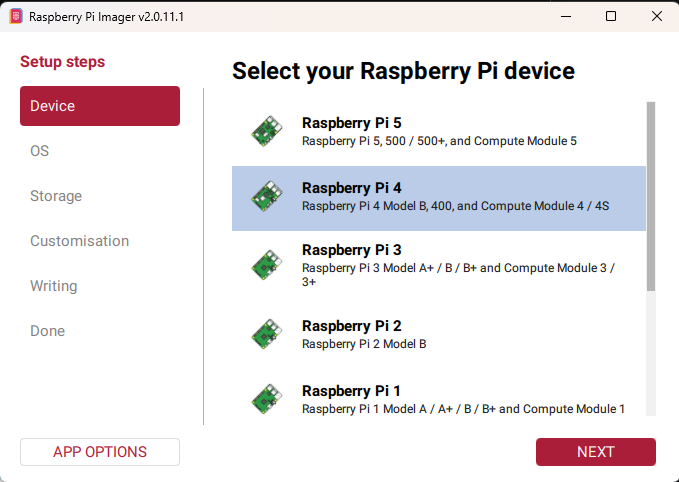

Select **Raspberry Pi 4**, confirm that its row is highlighted, and click **NEXT**.

### 9.3 Open the alternate Raspberry Pi OS list

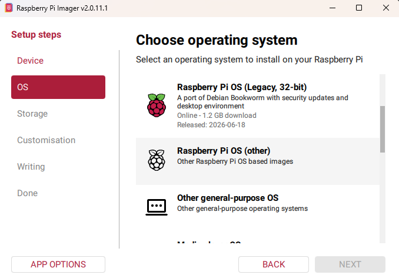

Scroll down and select **Raspberry Pi OS (other)**. Do not select a visible legacy 32-bit image or **Other general-purpose OS**.

### 9.4 Select Raspberry Pi OS Lite 64-bit

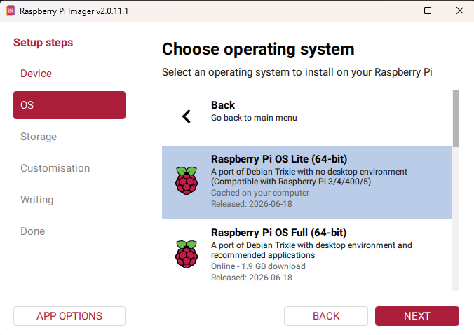

Select **Raspberry Pi OS Lite (64-bit)** and click **NEXT**. The appliance installs its own kiosk environment; do not select Raspberry Pi OS Full.

### 9.5 Select the microSD card

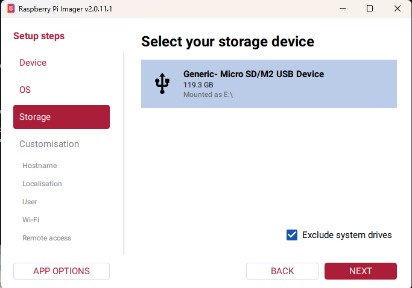

Select the microSD card that will be installed in the scanner appliance, then click **NEXT**. Its manufacturer, capacity, device name, and drive letter may differ from the example.

> **Warning:** Writing the image permanently erases the selected device. Confirm its capacity and Windows drive letter. Keep **Exclude system drives** selected, and never select the provisioning workstation's internal drive.

### 9.6 Assign and record the hostname

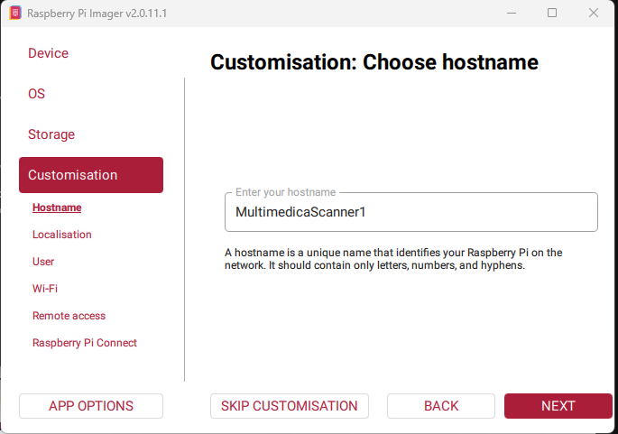

Enter a unique lowercase Pi hostname and click **NEXT**. Record it in the installation worksheet introduced in Section 3 because every later `-PiHost` command uses it.

Recommended examples:

```text
multimedica-lab-01
multimedica-reg-01
```

Although hostnames are generally case-insensitive, lowercase avoids confusion when copying commands.

### 9.7 Configure localization

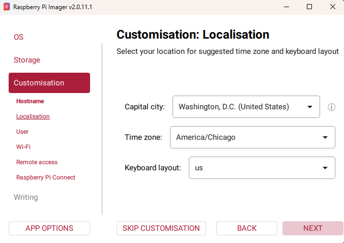

Configure localization for the appliance's operating location, not necessarily the provisioning workstation's location.

For a Wisconsin test appliance:

```text
Capital city:    Washington, D.C. (United States)
Time zone:       America/Chicago
Keyboard layout: us
```

For an appliance deployed in Guatemala, select the corresponding Guatemala location and use `America/Guatemala`. Use the `us` keyboard layout unless the support keyboard requires another layout. The time zone affects logs, displayed time, troubleshooting, and scheduled clinic behavior.

### 9.8 Create the Pi user

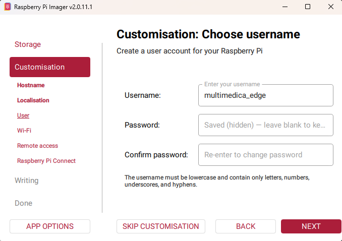

Enter the required username exactly:

```text
multimedica_edge
```

Create a strong unique password and enter it in both password fields. Store it in the approved password manager or secure credential record. Do not place it in the installation worksheet, Git, screenshots, or console transcripts.

### 9.9 Configure initial Wi-Fi access

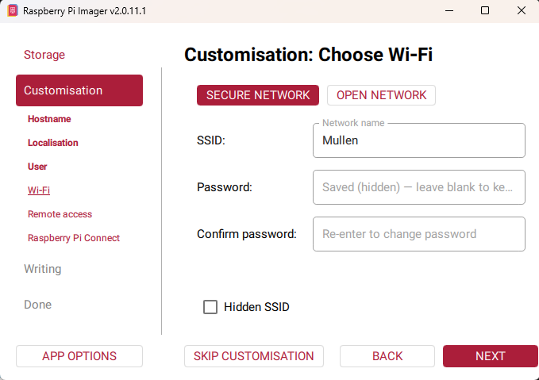

Image-time Wi-Fi is highly recommended because it lets the new Pi join the network immediately. Select **SECURE NETWORK**, enter the SSID and password, confirm the password, and click **NEXT**.

This step may be omitted when wired Ethernet will be connected before first boot and DHCP is available. Image-time Wi-Fi provides installation connectivity; it does not replace the later Multimedica Wi-Fi commissioning QR.

### 9.10 Enable SSH with password authentication

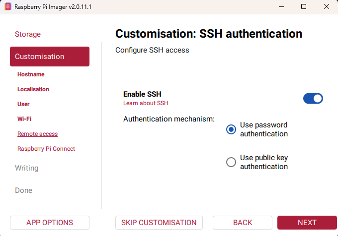

Turn on **Enable SSH**, select **Use password authentication**, and click **NEXT**. The later `-ConfigureSshAccess` operation installs and verifies the dedicated Multimedica provisioning key.

### 9.11 Leave Raspberry Pi Connect disabled

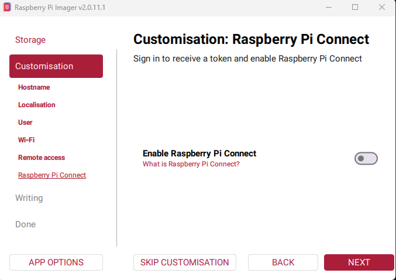

Leave **Enable Raspberry Pi Connect** turned off and click **NEXT**. The supported process uses direct SSH and does not require a Raspberry Pi Connect account or token.

### 9.12 Review and write

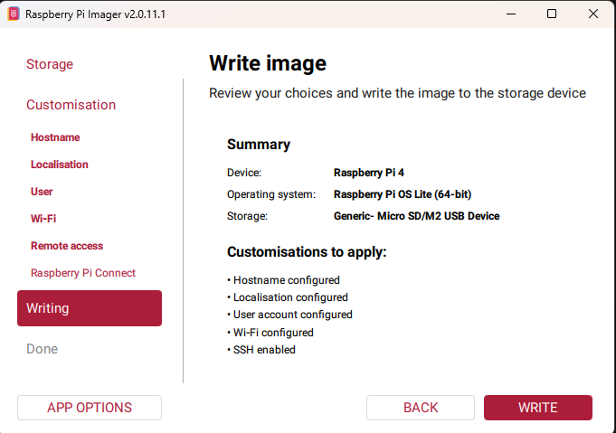

Confirm Raspberry Pi 4, Raspberry Pi OS Lite 64-bit, the intended microSD card, hostname, localization, user account, network choice, and SSH. If correct, click **WRITE**.

### 9.13 Confirm erasure

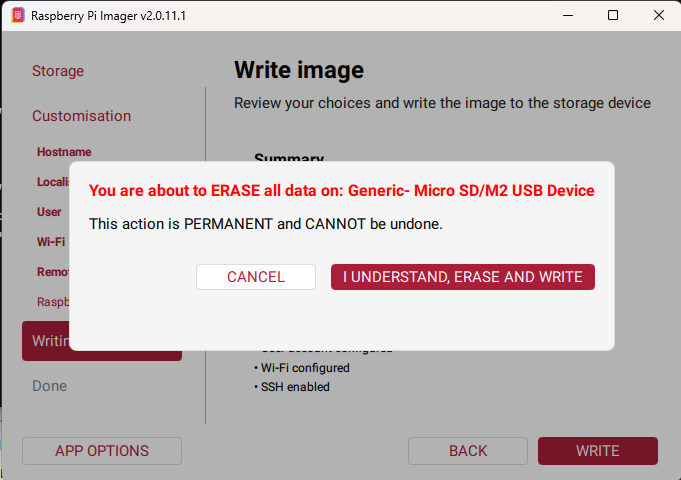

Verify the named device once more. Click **I UNDERSTAND, ERASE AND WRITE** only when it is positively identified as the intended microSD card. Otherwise click **CANCEL**.

### 9.14 Wait for writing and verification

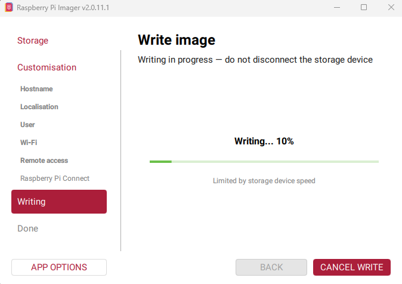

Allow both **Writing** and **Verifying** to complete. Do not cancel, remove the card, disconnect the reader, shut down the workstation, or allow it to sleep. Duration varies, and progress may pause temporarily without indicating failure.

### 9.15 Finish and remove the card

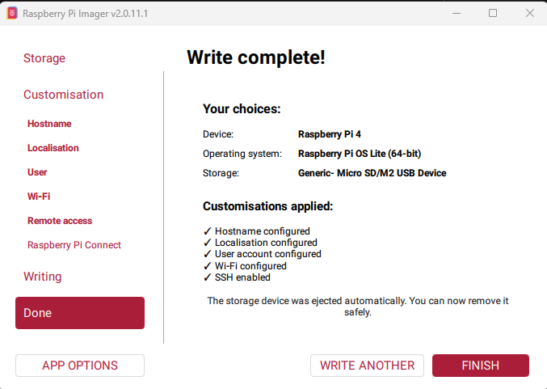

After Imager reports **Write complete!**, click **FINISH** and remove the automatically ejected microSD card.

### 9.16 First boot

1. Insert the microSD card.
2. Connect display, scanner, and network.
3. Apply power.
4. Allow the first boot to finish.

From **Windows PowerShell**, set the recorded values if they are not already present, then confirm that the Pi is reachable:

```powershell
$piUser = Read-Host "Enter the Pi username recorded during imaging"
$piHostname = Read-Host "Enter the Pi hostname recorded during imaging"
$piHost = "$piUser@$piHostname"
Test-Connection -ComputerName $piHostname -Count 2
```

If name resolution is unavailable, obtain the Pi's address from the router or DHCP system and set:

```powershell
$piIp = Read-Host "Enter the Pi IP address"
$piHost = "$piUser@$piIp"
```

> **Where you are now:** The Pi has a clean operating system, its recorded network identity, and initial SSH access. Multimedica software has not yet been installed.

---

## 10. Establish provisioning SSH access

**Windows PowerShell:**

```powershell
.\provision-scanner.ps1 `
  -ConfigureSshAccess `
  -PiHost $piHost
```

When asked whether the Pi was reimaged:

- answer lowercase `yes` for a newly imaged card;
- answer lowercase `no` only when the existing SSH identity is expected.

Enter the Pi account password when SSH requests it. The script installs and verifies a dedicated provisioning public key. Successful output ends with:

```text
Key-based SSH verified; provisioning will not prompt for the Pi password
```

If SSH reports an identity change after answering `no`, stop and verify that this is the intended physical Pi.

---

## 11. Install the bootstrap platform

**Windows PowerShell:**

```powershell
.\provision-scanner.ps1 `
  -Install `
  -PiHost $piHost `
  -InstallerConfig .\multimedica-installer.json `
  -ResultFile .\provisioning-result.json
```

At the sudo prompt, enter the Pi password once and press Enter. The password will not appear. Wait after pressing Enter; do not type it again unless another visible prompt appears.

The first installation may take several minutes while operating-system and npm packages are installed.

The script will:

- check the platform baseline;
- stage bootstrap files;
- install dependencies and services;
- install restricted privileged helpers;
- start and validate controller, display, and kiosk services;
- verify the scanner device and reader;
- reboot the Pi;
- verify that services recover after reboot.

During installation, the physical screen may show:

```text
Finalizando la instalación
Espere. No escanee códigos todavía.
```

Do not scan configuration QRs while this waiting message is displayed. Wait for the command to report `RESULT: PASS` and for the display to request configuration.

Required console result:

```text
RESULT: PASS
```

> **Where you are now:** The operating system and Multimedica bootstrap layer are installed. The appliance can read commissioning QRs, but it is not yet configured for its clinic assignment and production software is not yet installed.

---

## 12. Commission the scanner appliance

Scan QRs only after bootstrap installation has passed and the display requests configuration.

### 12.1 Wi-Fi QR

**Scanner:** Scan the Wi-Fi QR when Wi-Fi configuration is required.

The Pi applies and verifies the NetworkManager connection before storing it as authoritative. If the QR fails, do not continue on the assumption that image-time Wi-Fi is sufficient; preserve the message and diagnose the failure.

Applying different Wi-Fi credentials may temporarily interrupt SSH or change the Pi address.

### 12.2 Station QR

**Scanner:** Scan the Station QR.

Verify that the display acknowledges the station configuration in Spanish.

### 12.3 Cloud QR

**Scanner:** Scan the Cloud QR.

Verify that the display acknowledges the cloud configuration in Spanish.

When all required configuration is accepted, the display should show:

```text
Configuración completa
```

The controller may retain previously valid Station or Cloud configuration on a reinstallation. If it does not request a QR, use `-Verify` to inspect the actual configuration state rather than assuming a scan was ignored.

---

## 13. Verify bootstrap and commissioning

**Windows PowerShell:**

```powershell
.\provision-scanner.ps1 `
  -Verify `
  -PiHost $piHost `
  -ResultFile .\provisioning-result.json
```

Required observations include:

- configuration complete;
- display service active;
- controller service active;
- kiosk service active;
- display health endpoint responsive;
- physical Chromium kiosk active;
- scanner USB device detected;
- scanner reader active.

Required result:

```text
RESULT: PASS
```

Do not install production if verification fails.

> **Where you are now:** You now have a basic, commissioned scanner appliance with verified scanner input, display, kiosk, network, station, and cloud configuration. The final installation step is to load and promote the approved production software.

---

## 14. Install the production release

Section 8.5 loaded and validated the repository's approved release. Confirm that those variables are still available in the current PowerShell window:

```powershell
$releaseVersion
$artifact
$sha
```

All three commands must display nonblank values. If any is blank, return to section 8.5 and rerun its complete validation block. Then, in the same PowerShell window, run:

```powershell
.\provision-scanner.ps1 `
  -InstallRelease `
  -PiHost $piHost `
  -ReleaseVersion $releaseVersion `
  -ArtifactPath $artifact `
  -ArtifactSha256 $sha `
  -ResultFile .\provisioning-result.json
```

The installer stages and validates the release, starts it as an isolated candidate, and asks:

```text
Confirm the physical display showed the CANDIDATO state.
Type lowercase yes to continue:
```

Inspect the physical Pi display.

- If it visibly shows `CANDIDATO`, type lowercase `yes` and press Enter.
- If it does not, do not authorize promotion.

A successful installation includes:

```text
INSTALL_RELEASE_COMPLETE
RESULT: PASS
```

The release is not recorded as known-good until production starts through the production service and passes health verification.

> **Where you are now:** The approved production release is installed and has passed candidate and first-activation checks. Complete the physical and operational acceptance checks below before turning the appliance over for use.

---

## 15. Final appliance acceptance

### 15.1 Read-only verification

Run `-Verify` again after production installation:

```powershell
.\provision-scanner.ps1 `
  -Verify `
  -PiHost $piHost `
  -ResultFile .\provisioning-result.json
```

Confirm `RESULT: PASS` and that production is active and healthy.

### 15.2 Physical clinic state

Confirm that the display:

- uses portrait orientation;
- fills the intended display area;
- uses the approved El Alfarero logo, colors, and layout;
- reports the correct station and clinic state;
- contains no unexpected English commissioning text.

### 15.3 Scanner identity QR

Scan the **Mostrar Identidad** QR.

Confirm that a temporary Spanish identity screen appears and shows:

- location ID;
- room ID;
- station ID;
- device ID;
- current IP address;
- installed production version.

Confirm that it contains no credentials and automatically returns to the clinic display after approximately 15 seconds.

### 15.4 Real patient scan

Scan one approved real or designated acceptance patient barcode.

Confirm:

- the scan is accepted by production;
- the expected cloud workflow occurs;
- the display updates to the expected clinic state;
- no obsolete “Patient Scan Accepted” overlay appears.

### 15.5 Cold-boot recovery

Perform one controlled power cycle or approved reboot. Allow the Pi to return without operator intervention.

Confirm:

- startup display remains stable rather than scrambled;
- bootstrap services return;
- release recovery authorizes the known-good production release;
- production becomes active;
- the correct clinic state returns.

Run `-Verify` one final time and retain the result with the installation record.

---

## 16. Supported maintenance operations

### 16.1 Diagnose without changing the Pi

Use:

```powershell
.\provision-scanner.ps1 -Verify ...
```

This should be the first action for an uncertain appliance state.

### 16.2 Update approved display resources

This operation updates the supported display bundle without replacing production. Begin with a clean, current repository checkout as described in section 7.5. From the repository root, run:

```powershell
.\provision-scanner.ps1 `
  -UpdateDisplay `
  -PiHost $piHost `
  -ResultFile .\provisioning-result.json
```

Enter the Pi sudo password when requested. Do not manually copy display files onto the Pi.

Required result:

```text
RESULT: PASS
```

Afterward, run `-Verify`, inspect the physical display, and confirm the correct clinic state returns.

### 16.3 Install new production code

Obtain the approved new production artifact, version, and SHA-256 from the release owner. The authoritative repository is <https://github.com/paullmullen/multimedica-scanner>. Update its Windows checkout; do not update source code directly on the Pi.

Unless a qualified developer or release owner is actively supervising the work, the installer must deploy only code and artifacts that have already been approved and published through the normal release process. Do not edit source, invent a version, or build an unapproved production release during a field update.

From the repository root:

```powershell
git status --short
git switch main
git pull --ff-only origin main
git status --short
git log -1 --oneline
```

Each `git status --short` command must produce no output before the next prompt. If either prints any status code or filename, stop and seek qualified help.

The updated repository must include its approved-release pointer, artifact, checksum, and build metadata. Rerun the complete validation block in section 8.5; it will establish `$releaseVersion`, `$artifact`, and `$sha` without asking the installer to select a version. Then run:

```powershell
.\provision-scanner.ps1 `
  -InstallRelease `
  -PiHost $piHost `
  -ReleaseVersion $releaseVersion `
  -ArtifactPath $artifact `
  -ArtifactSha256 $sha `
  -ResultFile .\provisioning-result.json
```

Authorize promotion only when the physical display shows `CANDIDATO`. Require `INSTALL_RELEASE_COMPLETE` and `RESULT: PASS`, then run `-Verify` and repeat the relevant physical acceptance checks.

Do not overwrite an installed version directory and do not reuse a version for different artifact contents.

### 16.4 Publish an approved production release — release owner only

This subsection is not a field-installer procedure. A qualified developer or release owner builds, tests, and explicitly approves a new version before an ordinary installer receives it.

Build the new version:

```powershell
$newReleaseVersion = Read-Host "Enter the new semantic production version"
npm run build:production-release -- $newReleaseVersion .\release-output
```

Run the required release and regression tests. After technical and operational approval, publish the local pointer:

```powershell
node .\release\approve-production-release.js $newReleaseVersion
Get-Content .\release-output\approved-production-release.json
```

The approval command fails unless the artifact, checksum sidecar, and build metadata all exist and the artifact hash matches. Review the generated pointer, then stage the complete release set together:

```powershell
git add `
  ".\release-output\multimedica-production-$newReleaseVersion.tgz" `
  ".\release-output\multimedica-production-$newReleaseVersion.tgz.sha256" `
  ".\release-output\multimedica-production-$newReleaseVersion.build.json" `
  .\release-output\approved-production-release.json

git diff --cached --check
git status --short
```

Commit and push only after review. The approved pointer and all three referenced files must be present in the same approved repository revision. Never update the pointer to files that have not been committed and published.

### 16.5 Bootstrap repair

`-Repair` is intended for bootstrap states where release management permits broad repair. It intentionally refuses to overwrite a production-managed appliance when doing so could invalidate release and recovery state.

Do not bypass this refusal with manual root file copies. Escalate for a release-aware bootstrap upgrade or supported narrow update.

There is currently no general automatic bootstrap updater and the Pi does not run `git pull`. GitHub is the source for the Windows provisioning workstation; validated files and production artifacts reach the Pi only through supported provisioning operations.

---

## 17. Installation record

Record at minimum:

```text
Installation date:
Installer:
Hostname:
Pi IP address:
Location:
Station:
Room ID:
Device ID:
Qualified image:
Repository revision:
Production version:
Production SHA-256:
Initial Verify result:
Post-release Verify result:
Cold-boot Verify result:
Physical display accepted:
Real scan accepted:
Notes:
```

Do not record passwords, QR administrator tokens, shared secrets, or Wi-Fi credentials in the installation record.

---

## 18. Completion checklist

- [ ] Qualified hardware assembled correctly
- [ ] Raspberry Pi Imager completed writing and verification
- [ ] Pi imaged with correct user and SSH settings
- [ ] `-ConfigureSshAccess` completed
- [ ] `-Install` returned `RESULT: PASS`
- [ ] `-Install` passed and the display requested configuration before QR scanning
- [ ] Required QRs accepted
- [ ] Display reported `Configuración completa`
- [ ] Pre-release `-Verify` returned `RESULT: PASS`
- [ ] Production artifact hash matched
- [ ] Physical display showed `CANDIDATO`
- [ ] `-InstallRelease` returned `RESULT: PASS`
- [ ] Post-release `-Verify` returned `RESULT: PASS`
- [ ] Correct clinic state displayed
- [ ] Identity QR showed the correct IDs, IP address, and production version
- [ ] Real patient scan accepted
- [ ] Cold boot recovered production and stable display
- [ ] Final `-Verify` returned `RESULT: PASS`
- [ ] Installation record completed without secrets
